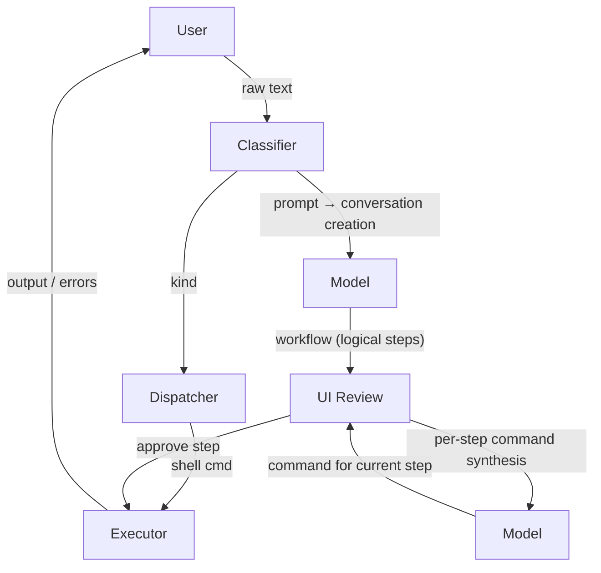

# Architecture Overview

## 🔍 System Overview

Parsec orchestrates a sophisticated dual-path execution model, intelligently routing user inputs through either direct shell execution or AI-powered multi-step workflow planning. At its core, an advanced classifier discerns input intent, ensuring AI-generated commands undergo rigorous user approval. The prompt handling pipeline operates in two distinct phases: high-level workflow planning (pure logic, no commands) and granular per-step command synthesis.

## 🏗️ Modular Crate Architecture

| Crate | Core Responsibilities |
|-------|----------------------|
| `parsec-core` | Defines domain entities and trait abstractions (`CommandClassifier`, `ModelProvider`, `WorkflowPlanner`, `StepCommandGenerator`, `ExecutionPlan`, `ConversationContext`). |
| `parsec-model` | Implements `ModelProvider` interfaces (initially Google AI Studio; designed for pluggability). |
| `parsec-executor` | Manages secure command execution with approval mechanisms and future sandboxing capabilities. |
| `parsec-prompt` | Orchestrates end-to-end prompt processing: workflow planning to per-step command generation. Integrates Python ML/LLM components via PyO3 or subprocess. Python assets reside in `py/` for isolated ML logic and API interactions. |
| `parsec-classifier` | Embedded Python ML classifiers for precise input categorization. |
| `parsec-ui` | Handles user interaction loops and future graphical interfaces. |

## 🔄 Data Flow Patterns

### Shell Command Execution Path
1. User submits textual input.
2. Classifier identifies as `InputKind::Shell`.
3. System activates or initializes session context.
4. Command executes directly within session environment.
5. Captures and logs execution results (stdout/stderr, exit codes) in session history.
6. Updates global session state (working directory, environment variables).

### AI Workflow Path
1. User submits textual input.
2. Classifier identifies as `InputKind::Prompt`.
3. System establishes session, generates unique Conversation ID, and initializes `ConversationContext`.
4. UI invokes `WorkflowPlanner` (Model Call #1) with session and conversation context, yielding logical steps only.
5. UI presents full workflow with active conversation indicator: `[<Conversation Name>] active`.
6. For current pending step: Upon user approval, UI calls `StepCommandGenerator` (Model Call #2+) with comprehensive context (session state, conversation history, step index, prior executions, environment deltas, error states).
7. Model returns structured JSON with candidate commands. UI displays primary option; user can approve, request alternatives, or abort.
8. Approved commands execute via executor, with outputs updating conversation and session contexts.
9. Iterates steps 7-8 until step completion; advances to next pending step.
10. On errors: Captures details, appends to context, relays to model for retry/alternatives. Aborts on unrecoverable failures.
11. Completion: All steps finished, conversation finalized, session updated with outcomes.

Refer to `PROMPT_HANDLING.md` for detailed state machines and data structures.

## 🧠 Classification Strategy

**Current Implementation**: Embedded Python with ML models for robust natural language processing. Utilizes structured JSON protocols for reliable Rust-Python interop.

## 🔒 Security Foundations

- **Zero Auto-Execution**: All model outputs require explicit user consent.
- **Command Transparency**: Full command preview prior to execution.
- **Audit Logging**: Comprehensive execution records (future: intelligent secret redaction).

## 🔌 Extensibility & Modularity

Trait-driven architecture enables seamless component swapping without disrupting UI or execution layers. Decoupled planning and synthesis supports hybrid scenarios (e.g., local models for commands, remote for planning). `ModelProvider` registry facilitates runtime configuration via files, environment variables, or UI controls.

The `parsec-prompt` crate's Python integration isolates ML/LLM logic in dedicated scripts (`py/` subdirectory), enabling rapid AI iteration without Rust recompilation while harnessing Python's ML ecosystem.

## Future GUI Implementation
Phase 1 implements TUI (crossterm). Future phases: native window interface (egui or GTK) with embedded pty support.
